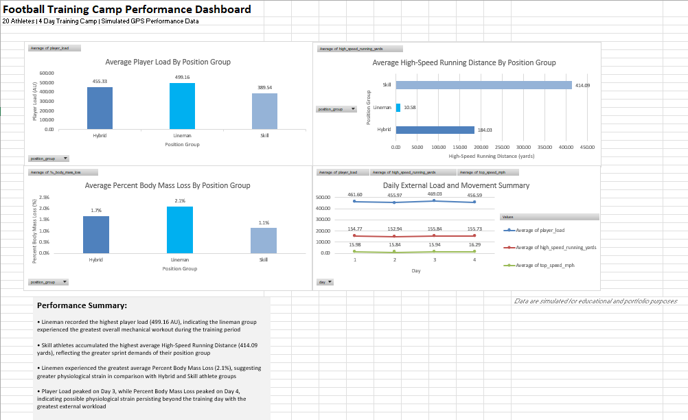

# Football Training Camp Performance Analysis

## Project Overview

This project demonstrates a complete sport science analytics workflow using a simulated four-day football training camp dataset. Athlete performance data were generated in Python and analyzed in Microsoft Excel using pivot tables, charts, and dashboard visualizations to evaluate workload and physiological responses across position groups.

The project was developed to demonstrate practical skills in sport science analytics, data visualization, and performance monitoring.

---

## Objectives

* Evaluate external workload across football position groups.
* Compare High-Speed Running Distance (H-SRD) demands.
* Assess hydration using Percent Body Mass Loss (%BML).
* Monitor workload trends throughout a four-day training camp.
* Present findings through a professional dashboard and presentation.

---

## Dataset

* **20 simulated athletes**
* **4-day training camp**
* **80 athlete-day observations**

### Variables

* Player Load
* High-Speed Running Distance (H-SRD)
* Top Speed
* Maximum Velocity
* Fluid Loss
* Baseline Body Weight
* Post-Practice Body Weight
* Percent Body Mass Loss (%BML)

---

## Project Workflow

```text
Python Data Simulation
        ↓
Microsoft Excel Analysis
        ↓
Pivot Tables & Charts
        ↓
Performance Dashboard
        ↓
PowerPoint Presentation
```

---

## Tools Used

* Python
* Microsoft Excel
* Pivot Tables
* Pivot Charts
* Dashboard Design
* Data Visualization
* Performance Data Analysis

---

## Dashboard Preview


```markdown

```

---

## Key Findings

* Linemen recorded the highest average Player Load, indicating the greatest overall mechanical workload.
* Skill players accumulated the highest High-Speed Running Distance, reflecting greater sprint demands.
* Linemen demonstrated the highest average Percent Body Mass Loss, suggesting greater physiological strain during training.
* Player Load peaked on Day 3, while Percent Body Mass Loss peaked on Day 4, indicating a delayed physiological response to external workload.

---

## Repository Contents

* `Football_Training_Camp_Dashboard.xlsx`
* `Football_Training_Camp_Performance_Presentation.pptx`
* `simulate_training_camp.py`
* `dashboard.png`

---

## Future Improvements

* Develop an interactive Microsoft Power BI dashboard.
* Add filtering by player, position group, and training day.
* Expand the dataset with additional athlete monitoring metrics.
* Incorporate SQL for database storage and querying.

---

**Note:** This project uses simulated athlete performance data and was created for educational and portfolio purposes.
